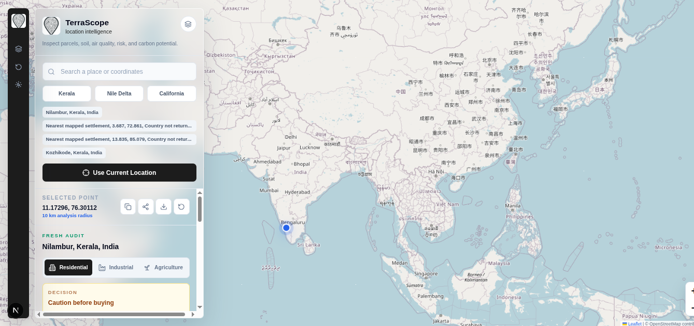
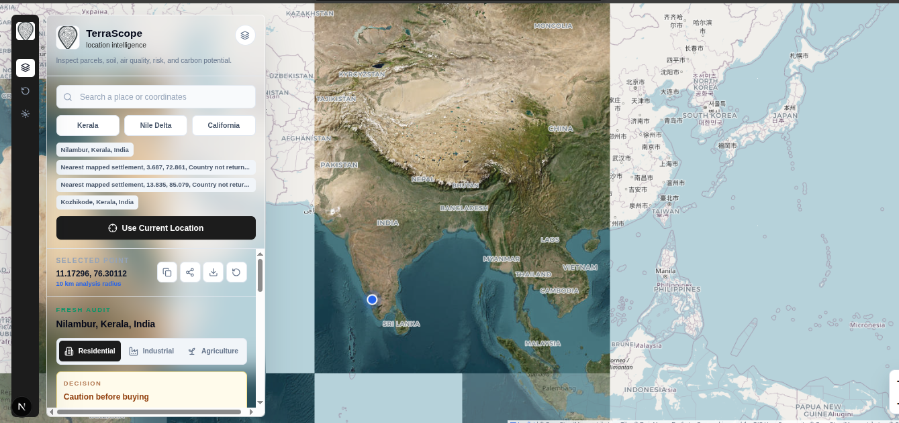
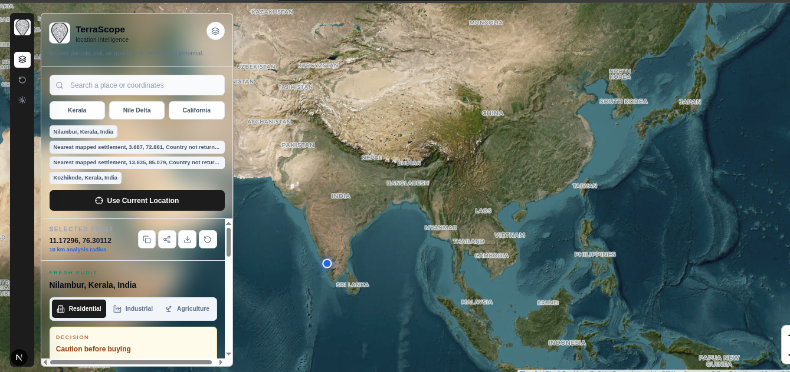

# TerraScope

## Overview

TerraScope is a global spatial-intelligence workspace that turns a selected map coordinate into a clear land-screening report. It brings together environmental conditions, soil indicators, nearby services, climate context, and land-use views for residential, industrial, and agricultural decisions.

## Problem Statement

People often compare land with fragmented information: a satellite map in one place, weather in another, soil data elsewhere, and no easy way to understand the limitations of each signal. That makes early purchase, construction, agriculture, and site-selection decisions unnecessarily opaque.

## Solution

TerraScope lets a user search or tap any global coordinate, then produces a 10 km screening report with clear evidence and limitations. It keeps residential, industrial, and agricultural questions separate, provides a monthly climate-trigger timeline, and routes users to the next verification step instead of presenting uncertain data as a final answer.

## Features

- Zoomable Leaflet map with place search, current-location support, satellite layer, and day/night appearance.
- Residential, industrial, and agriculture screening views with only useful evidence displayed.
- Soil pH, nitrogen, soil organic carbon, weather, air quality, nearby facilities, and earthquake-history context.
- Reproducible residential screening score based on air quality, forecast rain, wind, and nearby recorded earthquakes.
- Climate outlook with historical annual indicators, current conditions, 16-day forecast context, CSV export, and an interactive 2012-present monthly trigger timeline.
- External land-market research links for selected India locations, including 99acres, Housing, Magicbricks, NoBroker, and 1acre searches.
- Supabase PostGIS 500 m spatial cache for completed location audits when configured.
- Custom TerraScope location-pin loading animation across map, audit, and details flows.

## Tech Stack

- **Frontend:** Next.js App Router, React, TypeScript, Tailwind CSS, Leaflet
- **Backend:** Next.js Route Handlers and a Python climate-prediction service
- **Database:** Supabase PostgreSQL with PostGIS spatial queries
- **APIs / Services:** Open-Meteo, ISRIC SoilGrids, OpenStreetMap Nominatim and Overpass, USGS earthquake catalogue, OpenAI Responses API
- **Hosting / Deployment:** Ready for a Next.js-compatible deployment; configure the climate service and server-side environment variables for production
- **Other Tools:** ESLint, TypeScript, Git, CSV export

## Codex / OpenAI Usage

Codex was used during the build for architecture planning, implementation, debugging, type-checking, linting, build verification, documentation, UI refinement, and API integration. OpenAI is optionally used server-side to turn verified environmental and mapping inputs into structured location summaries. The deterministic score and climate timeline remain source-driven so their inputs and limitations stay inspectable.

## Demo

### Live Demo

Local development: `http://127.0.0.1:3000`

Repository: [github.com/stairmoss/Terrascope](https://github.com/stairmoss/Terrascope)

### Demo / Pitch Video

[Watch the TerraScope demo video](docs/screenshots/demo.webm)

Suggested walkthrough: open the map, select a coordinate, compare the three land-use views, create a climate outlook, inspect the monthly timeline, and export the CSV.

## Screenshots





## How to Run Locally

```bash
git clone https://github.com/stairmoss/Terrascope.git
cd Terrascope
npm install
```

Create `.env.local` with server-side credentials:

```bash
OPENAI_API_KEY=your_openai_key
NEXT_PUBLIC_SUPABASE_URL=https://your-project.supabase.co
SUPABASE_SERVICE_ROLE_KEY=your_server_only_supabase_key
```

Start the climate predictor in one terminal:

```bash
npm run climate:predictor
```

Start the web app in another terminal:

```bash
npm run dev -- --hostname 127.0.0.1 --port 3000
```

Open `http://127.0.0.1:3000`.

## Additional Notes

- Run `supabase/location_audits.sql` in the configured Supabase project to enable PostGIS and the 500 m spatial cache.
- Do not expose `SUPABASE_SERVICE_ROLE_KEY` through a `NEXT_PUBLIC_` variable or client-side code.
- Climate percentages are historical weather-trigger indicators, not a forecast that a specific disaster will occur. Flood, landslide, construction, agriculture, purchase, insurance, and evacuation decisions require local authority guidance and qualified professional review.
- Verify the code with `npm run typecheck`, `npm run lint`, `npm run build`, and `python3 -m py_compile services/climate_predictor/server.py`.
